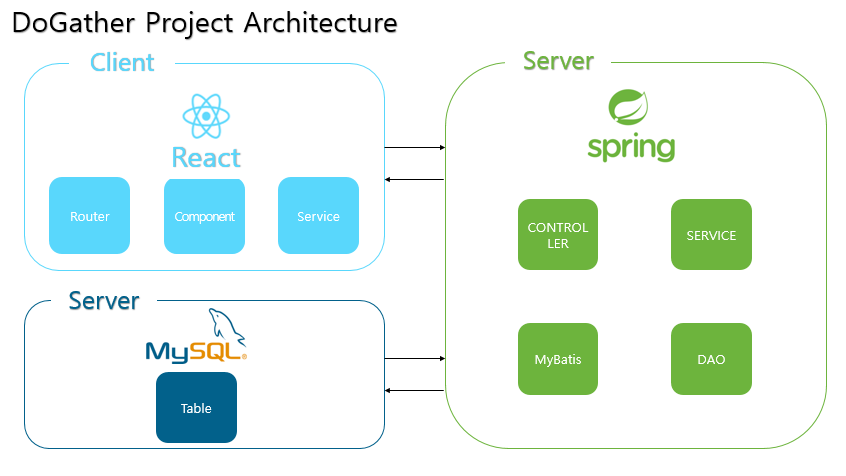
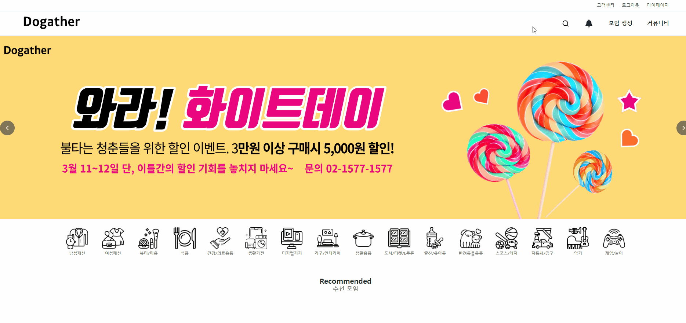
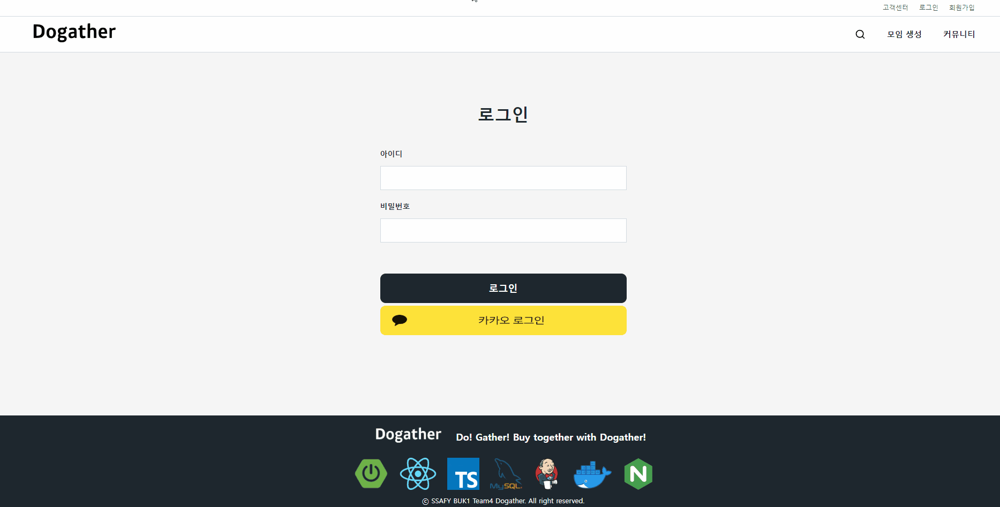
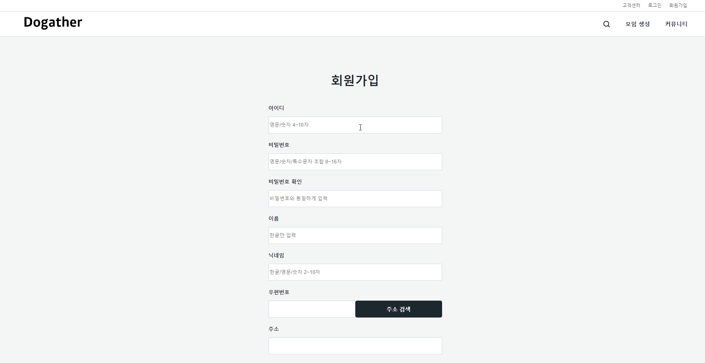
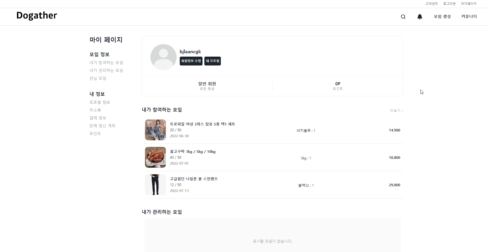
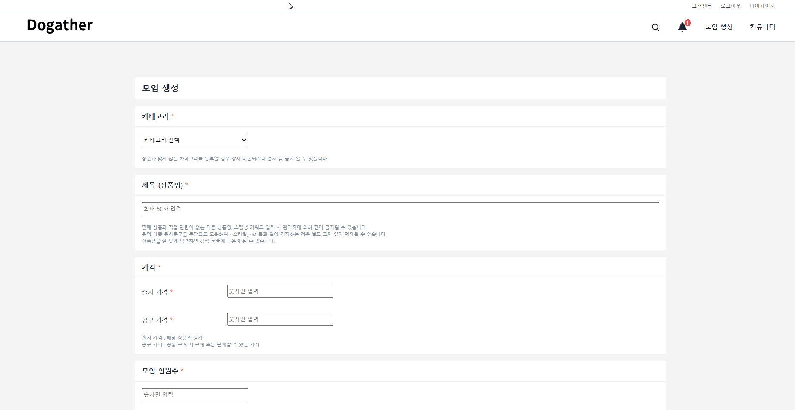

# 개요

> 공통 프로젝트 : 비전공자/전공자가 한 팀으로 웹/모바일 기반 서비스 구현
>
> - 웹파트 : 웹기술/웹디자인/웹IoT 중 택 1 ➝ 웹디자인 선택
> - 모바일 파트

구매자는 ‘모임 생성’ 서비스를 통해 인원을 모집하여 단체 구매로 물건을 더 저렴하게 구매할 수 있고 큐레이팅을 통해 가입 시 선택한 카테고리에 맞는 모임을 추천받을 수 있으며, 판매자는 판매할 제품을 게시하여 다수의 구매자에게 한 번에 판매할 수 있는 서비스

# 아키텍처

# 담당 개발 내용

## 프로젝트 세팅

- CRA를 통한 React 프로젝트 생성 (TypeScript)
- 초기 라이브러리 설치
- 폴더 구조
- `recoil`을 통한 상태관리 (`recoil-persist`를 통한 로컬 스토리지 활용)

## 디자인 및 퍼블리싱

- Header
  - 검색창 animation `framer-motion`
- 로그인
- 회원 가입/수정
- 마이페이지
- 모임 생성/수정
  - 옵션 및 FAQ Drag and drop  `react-beautiful-dnd`
- 알림
- 검색 결과

## 기능

- 로그인
- 회원 가입/수정
  - 닉네임 중복 확인
  - Daum 우편번호 서비스 API
- 회원 탈퇴
- 모임 생성/수정
  - `react-hook-form` 활용
  - 파일 업로드
- 알림
- 검색

# 산출물

- [Header](https://github.com/wonjongjang/PJT-Dogather/blob/master/Sub%20Pjt%202/pjt_client/Dogather/src/components/Nav/Header.tsx)

  

- [로그인](https://github.com/wonjongjang/PJT-Dogather/blob/master/Sub%20Pjt%202/pjt_client/Dogather/src/pages/Login/Login.tsx)

  

- [회원가입](https://github.com/wonjongjang/PJT-Dogather/blob/master/Sub%20Pjt%202/pjt_client/Dogather/src/pages/Signup/Signup.tsx)

  

- [마이페이지](https://github.com/wonjongjang/PJT-Dogather/blob/master/Sub%20Pjt%202/pjt_client/Dogather/src/pages/MyPage/MyPage.tsx) 및 회원 수정/탈퇴

  

- [모임 생성](https://github.com/wonjongjang/PJT-Dogather/blob/master/Sub%20Pjt%202/pjt_client/Dogather/src/pages/Moim/CreateMoim.tsx)

  
