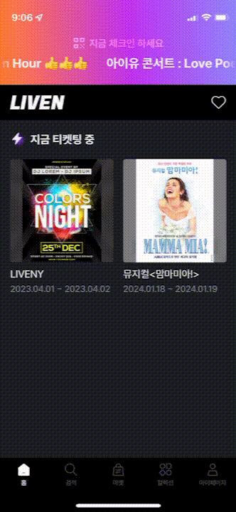
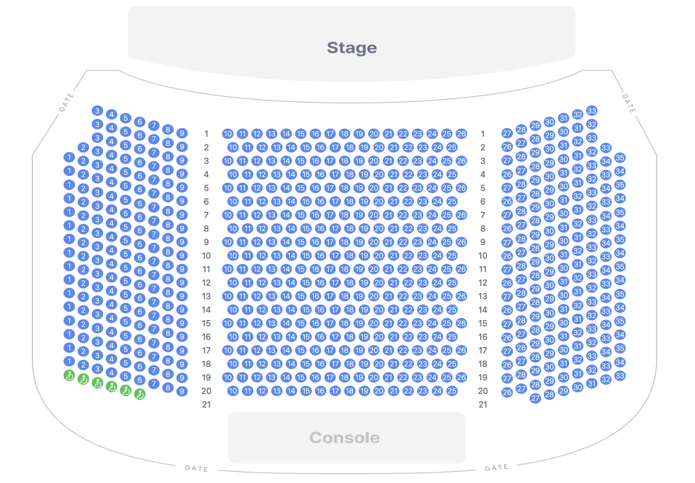

# 개요

> BoldAction 팀(기획1, 디자이너1, 백엔드2, 프론트엔드1)과 협업
>
> 프로젝트 후반부에 투입되어 FE 개발 담당

진짜 팬과 아티스트를 연결하는 NFT 공연 플랫폼

# 담당 개발 내용

## 퍼블리싱 및 기능

- 갤러리
  - 갤러리 목록 조회
  - 이미지 pan & pinch `pronestor/react-zoom-pan-pinch`
  - 동영상 재생 `react-player`
  
- 그룹 페이지
- 마켓 튜토리얼
  - 마켓 입장 시 튜토리얼 띄우기 `swiper`
  - 다시 보지 않기
- 좌석표 퍼블리싱

## QA

# 산출물

- 갤러리

  

- 마켓 튜토리얼

  

  

- 좌석표 퍼블리싱

  
