# 개요

메타버스 타겟의 NFT 커뮤니티 플랫폼

# 담당 개발 내용

## 프로젝트 세팅

- CRA를 통한 React 프로젝트 생성 (TypeScript)
- 초기 라이브러리 설치
- 폴더 구조
- 반응형 Layout
- `recoil`을 통한 상태관리
- prettier 및 eslint 세팅

## 퍼블리싱

- 로그인 Modal
- 회원 가입 Modal
- 프로필
- 프로필 수정
- 유니버스
- 커뮤니티
- 커뮤니티 생성/수정
  - 커뮤니티 배너 이미지 Drag and drop `react-beautiful-dnd`

- 포스트 상세
  - 트위터 트윗 임베드 `react-twitter-embed`

- Progress Indicator
  - Spinner
  - 스켈레톤 스크린 `react-loading-skeleton`

## 기능

- 로그인

- 비밀번호 찾기 (확인 메일 발송 및 재설정)

- 회원 가입

  - 랜덤 임시 닉네임 제공
  - 닉네임 중복 확인

- 이메일 인증 코드

- 프로필

  - 유저 정보 상세 조회
  - 해당 유저가 알림 설정한 게시글 목록 조회
  - 해당 유저가 작성한 게시글 목록 조회
  - 팔로우

- 프로필 수정

  - 유저 정보 수정
  - 닉네임 변경
  - 비밀번호 변경

- 지갑 연결

  - MetaMask `web3`
  - Coinbase Wallet `web3` [여러 지갑 처리](https://docs.cloud.coinbase.com/wallet-sdk/docs/injected-provider-guidance)
  - WalletConnect `@walletconnect/client`  `@walletconnect/qrcode-modal`

- Decentraland 프로필 가져오기

  - [Decentraland docs - Lambdas API reference](https://decentraland.github.io/catalyst-api-specs/#tag/Lambdas/operation/getAvatarDetails)

- 유니버스

  - 유니버스 상세 조회
  - 유니버스 게시글 조회

- 커뮤니티

  - 커뮤니티 상세 조회
  - 랜드/마켓 이동
  - 커뮤니티 팔로우
  - 게시글 검색
  - 커뮤니티 게시글 조회
  - NFT transaction 조회

- 커뮤니티 생성/수정

  - `react-hook-form` 활용

    - Input validation
    - Error message
    - useFieldArray 활용한 Dynamic form

  - 이미지 업로드

    - 이미지 미리보기
    - 파일 형식 및 용량 제한

  - Twitter OAuth

    - [OAuth 2.0 Authorization Code Flow with PKCE](https://developer.twitter.com/en/docs/authentication/oauth-2-0/authorization-code) 적용

    - URI에 client_id, redirect_uri, code_challenge 담아 요청 (code verifier는 `crypto-js` 활용)

    - 앱 승인 시 redirect_uri로 보내지면 query parameter에서 code를 받아옴

    - useEffect를 활용하여 code 가져왔을 때 백엔드에 code 전송

    - 백엔드 응답으로 트위터 username 가져옴

  - 커뮤니티에 보여줄 NFT를 보유한 지갑 등록

    - 백엔드에서 alchemy로 개발한 API에 지갑 주소를 담아 요청
    - 해당 지갑 주소로 제작한 컬렉션 목록 가져옴
    - 컬렉션 목록 중 커뮤니티에 트랜잭션을 보여주고 싶은 컬렉션들을 선택 후 저장

- 커뮤니티 삭제

# 산출물

- 로그인
  
  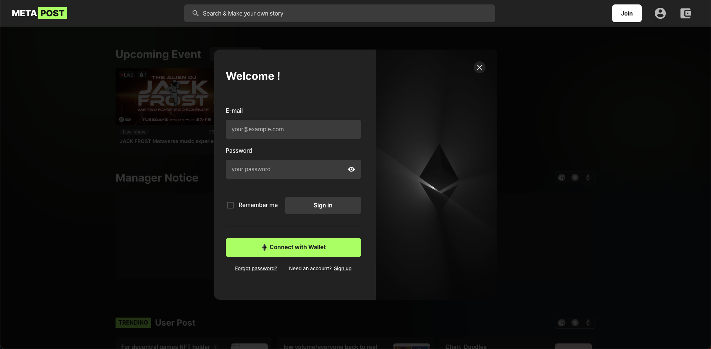
  
- 회원가입 - 지갑 연결 및 Decentraland 프로필 가져오기

  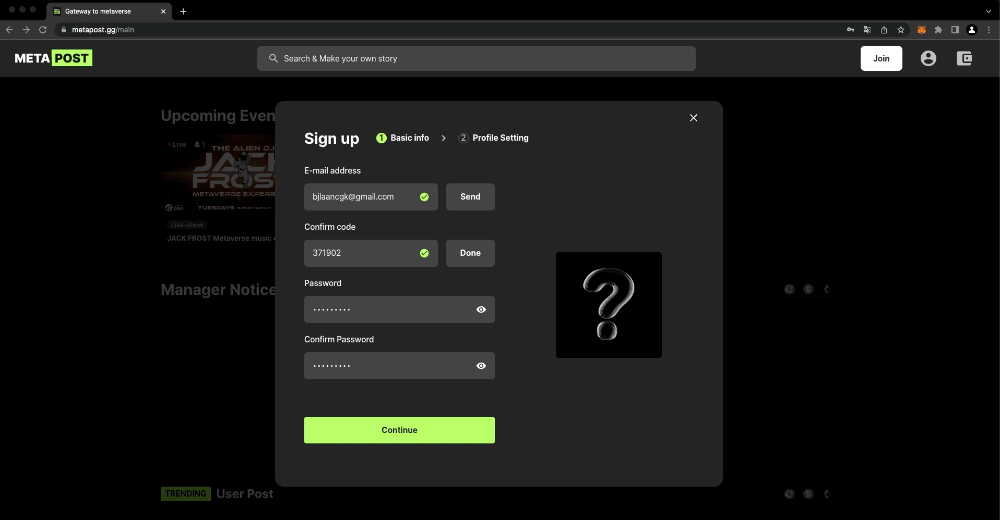

- 프로필

  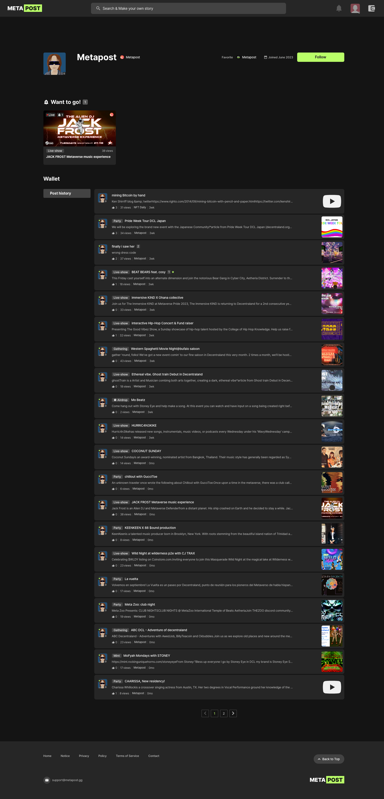

- 프로필 수정

  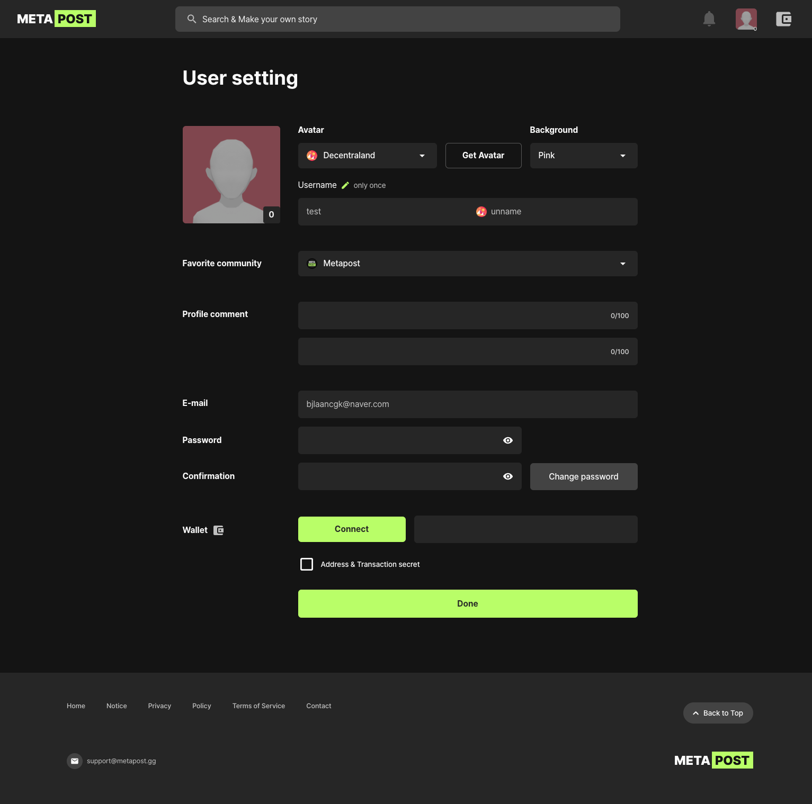

- 유니버스

  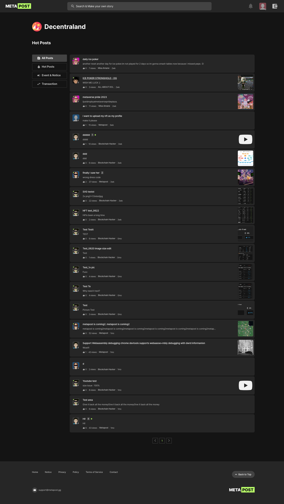

- 커뮤니티

  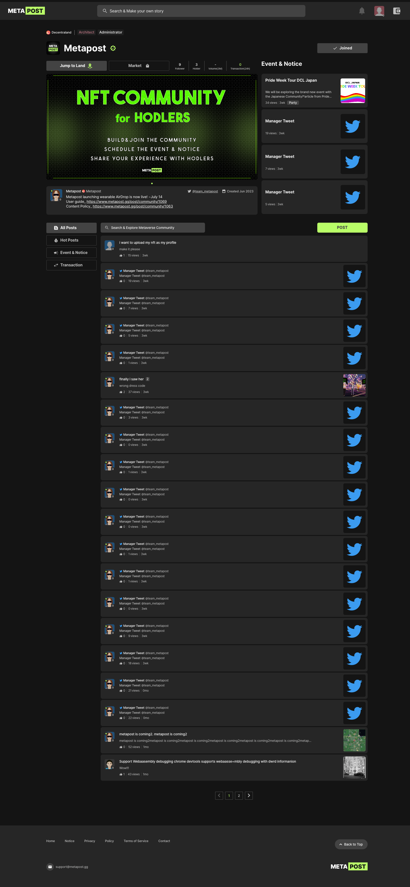

  - 랜드 이동 (Decentraland)

    

- 커뮤니티 생성

  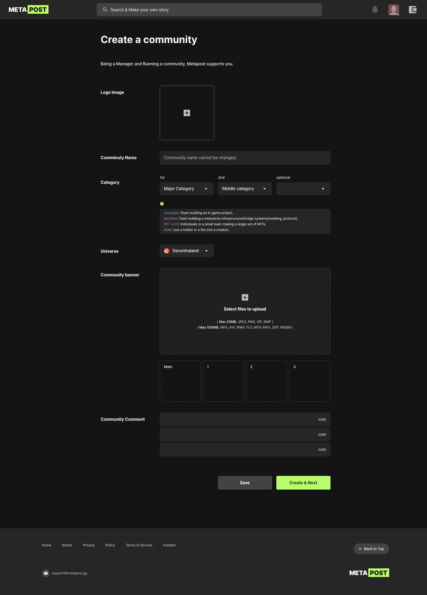

  - 배너 이미지 미리보기 및 Drag and drop

    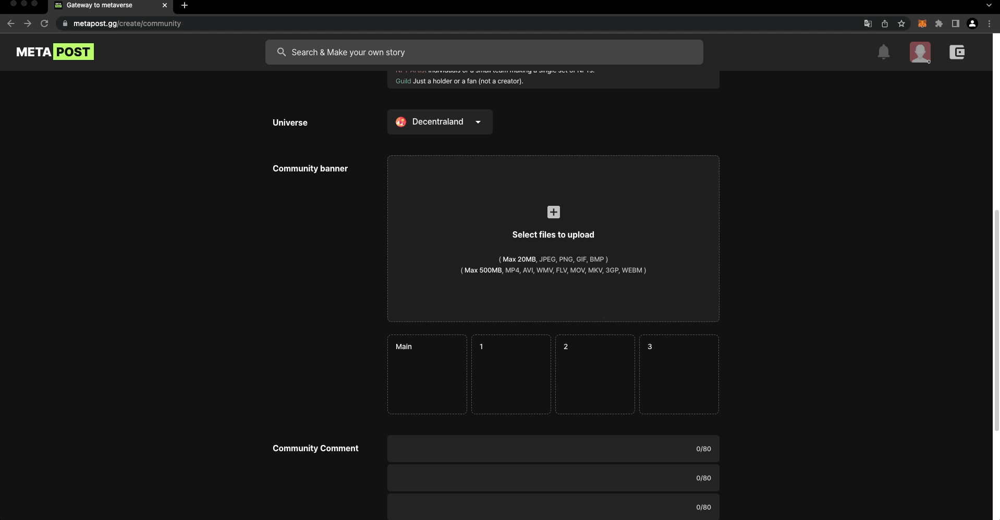

- 커뮤니티 수정

  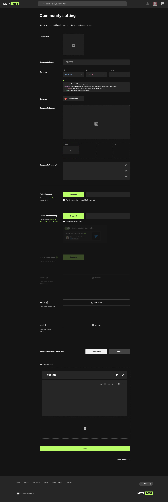

  - Twitter OAuth

    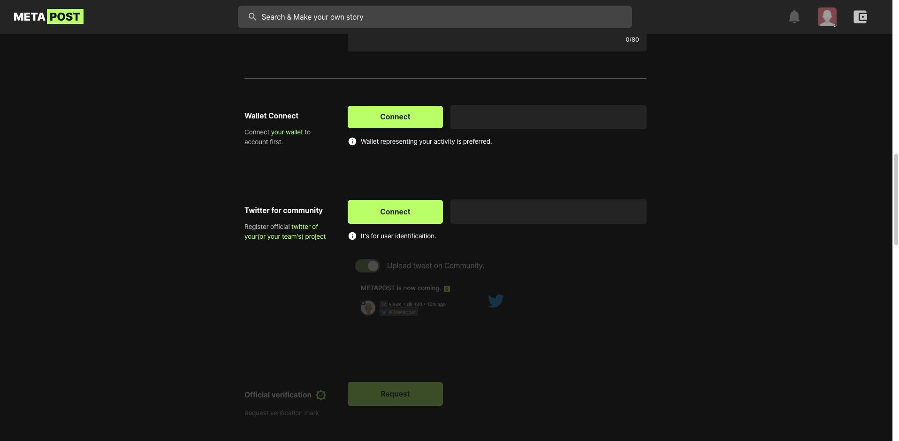

  - 커뮤니티에 보여줄 NFT를 보유한 지갑 등록

    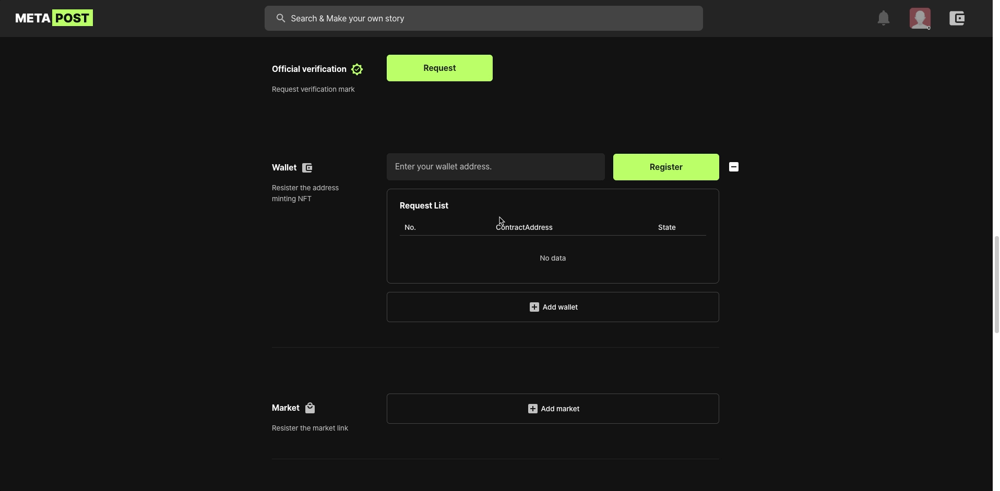

  - useFieldArray 활용한 Dynamic form

    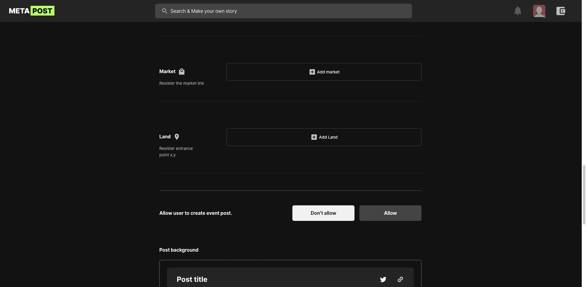

- 포스트 상세 - 트위터 트윗 임베드

  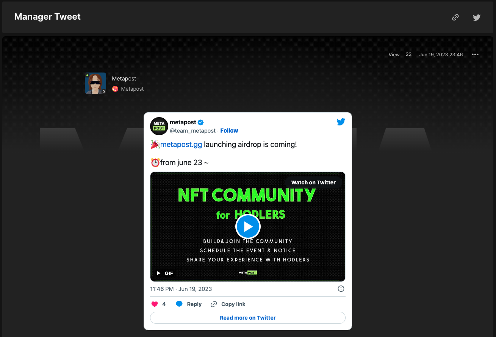
