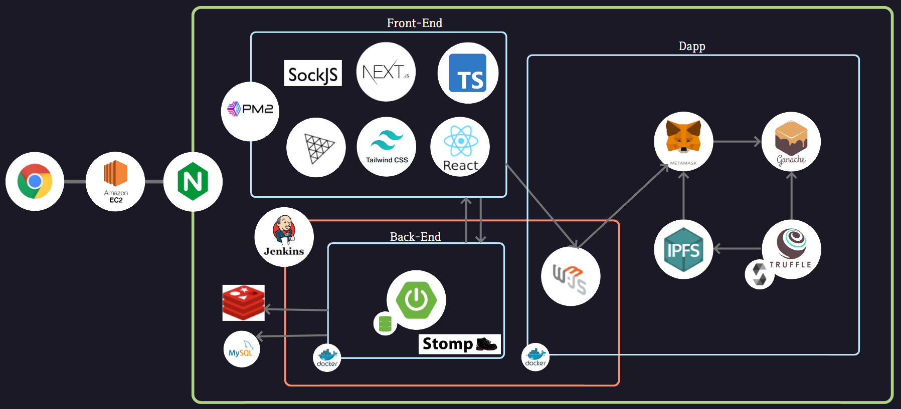
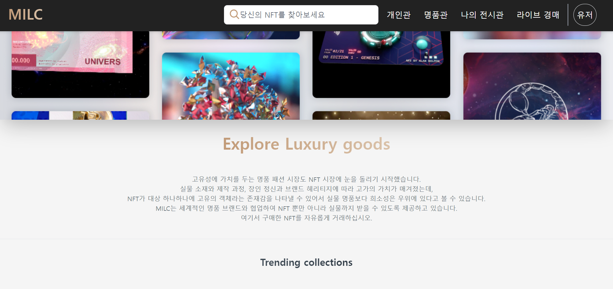
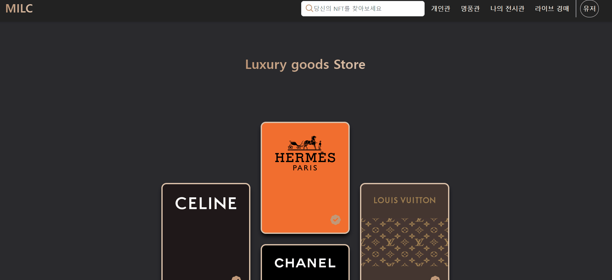
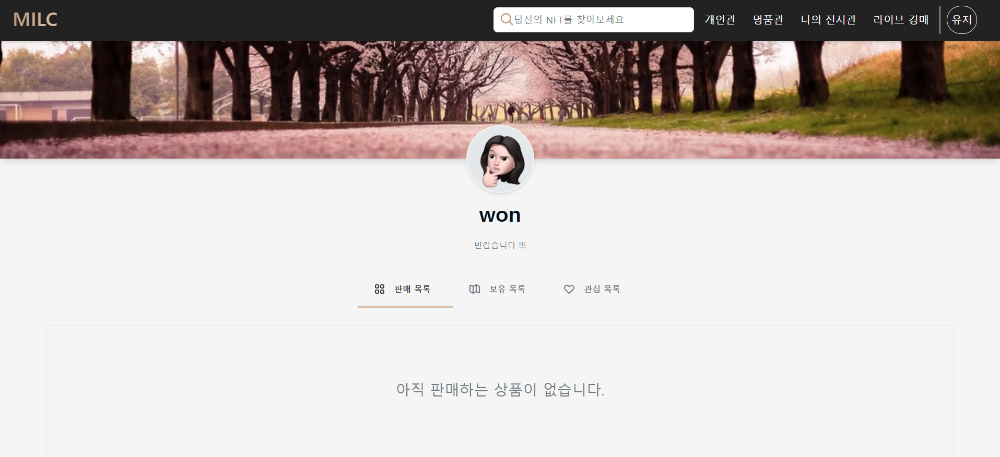
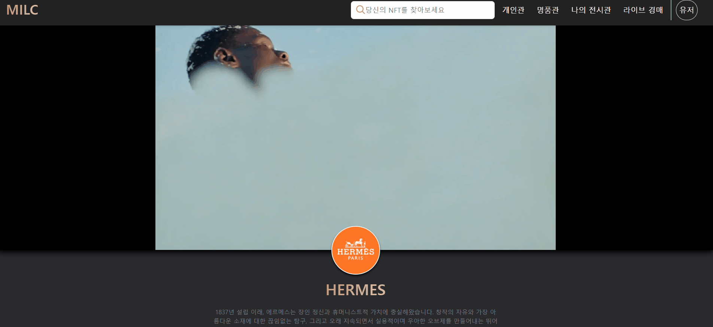
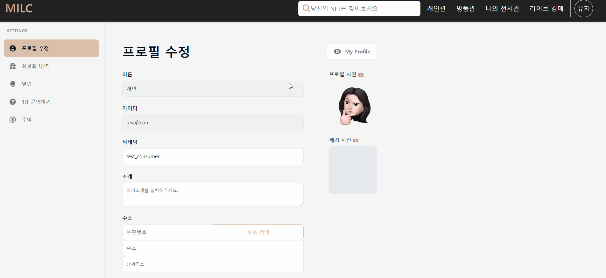
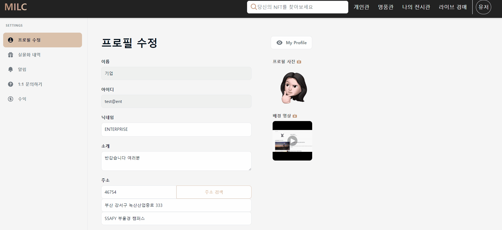
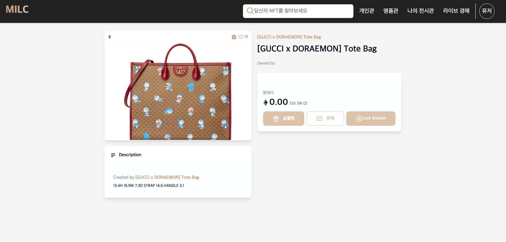

# 개요

> 특화 프로젝트 : 4차 산업혁명 분야 신기술 도메인 구현 프로젝트
>
> 인공지능/빅데이터/블록체인/IoT제어 중 택 1 ➝ 블록체인 선택

명품 기업과 협업하여 기업은 서비스를 이용해 자체 NFT를 발행하고, 개인은 인증된 명품 NFT를 구매 및 판매, 실물화를 통한 실물 상품 수령, 나만의 전시장에 NFT를 전시할 수 있는 서비스

# 아키텍처

# 담당 개발 내용

## 프로젝트 세팅

- CRA를 통한 React 프로젝트 생성 (TypeScript)
- 초기 라이브러리 설치
- 폴더 구조
- `recoil`을 통한 상태관리 (`recoil-persist`를 통한 로컬 스토리지 활용)

## 디자인 및 퍼블리싱

- 개인관
- 명품관
- 개인/기업 프로필
- 개인/기업 프로필 수정
- NFT 상품 상세

## 기능

- 로그인
- 회원가입
  - 닉네임 중복 확인
- 개인/기업 프로필 조회
- 개인/기업 프로필 수정
  - `react-hook-form` 활용
  - Daum 우편번호 서비스 API
  - Cloudflare API 활용한 사진/영상 업로드
- 좋아요
- NFT 실물화 요청 및 요청 리스트 조회

# 산출물

- [개인관](https://github.com/wonjongjang/PJT-MILC/blob/master/frontend/pages/individual/index.tsx)

  

- [명품관](https://github.com/wonjongjang/PJT-MILC/blob/master/frontend/pages/brand/index.tsx)

  

- [프로필](https://github.com/wonjongjang/PJT-MILC/blob/master/frontend/pages/profile/%5Bnickname%5D/index.tsx)

  - 개인

    

  - 기업

    

- [프로필 수정](https://github.com/wonjongjang/PJT-MILC/blob/master/frontend/pages/account/edit/index.tsx)

  - 개인

    

  - 기업

    

- NFT 상품 상세

  

