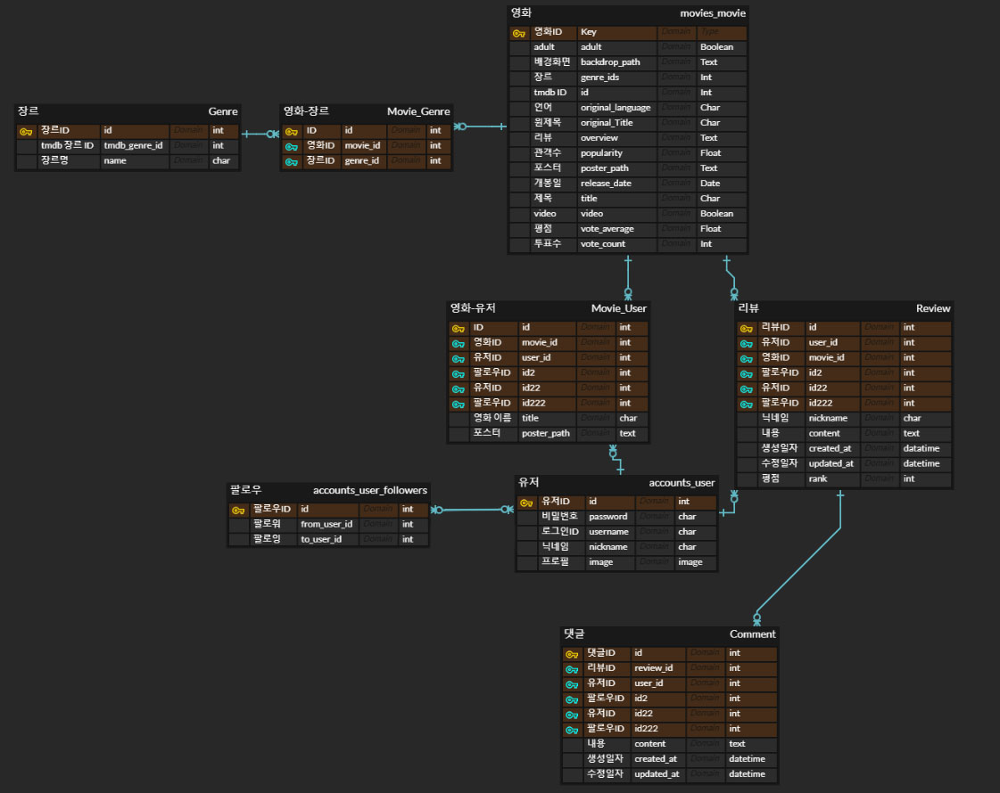
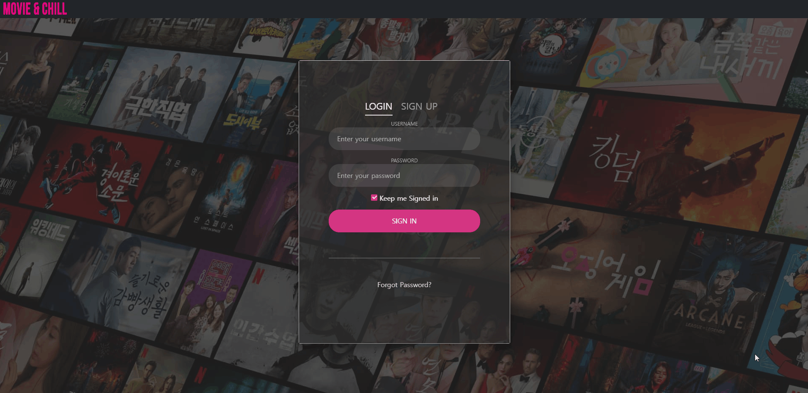
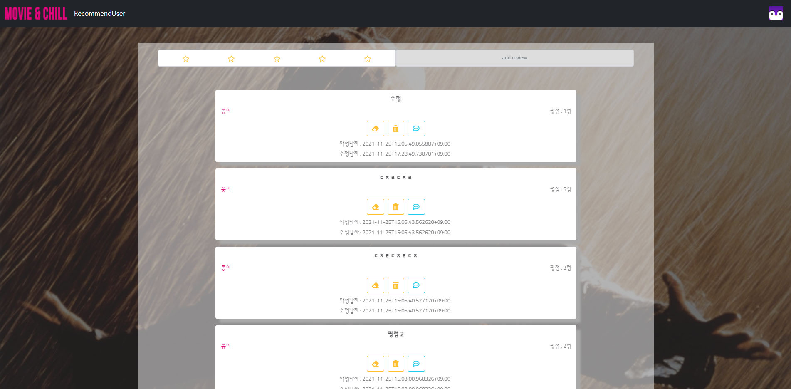
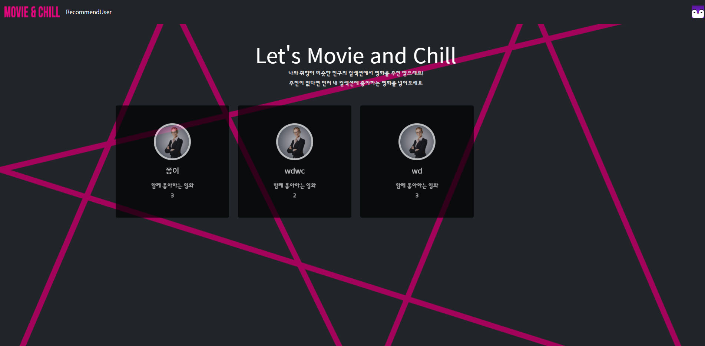
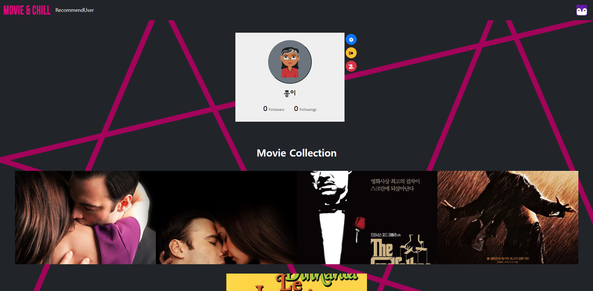

# 개요

자신이 좋아하는 영화를 좋아요 버튼을 눌러 자신만의 영화 컬렉션을 만들고, 관심 있는 컬렉션을 가진 사용자를 팔로우 하여 영화를 공유하며, 추천 기능을 통해 비슷한 컬렉션을 가진 사용자를 추천받을 수 있는 서비스

# 담당 개발 내용

## 프로젝트 세팅

- Vue.js
  - 프로젝트 생성
  - 폴더 구조
  - `vuex`를 통한 상태관리 (`vuex-persistedstate`를 통한 새로고침 초기화 방지)
- Django
  - 프로젝트 생성
  - TMDB API로 받아온 영화 정보를 csv 파일로 저장

## ERD

## 디자인 및 퍼블리싱

- 랜딩 페이지
- 로그인 및 회원가입
- 메인 페이지
- 리뷰 및 댓글
- 유저 추천
- 프로필 및 컬렉션

## 기능

- 영화 목록 API 개발 및 연동
- 영화 상세 API 개발
- 리뷰 생성/목록 API 개발 및 연동
- 리뷰 수정/삭제 API 개발 및 연동
- 댓글 생성/목록 API 개발 및 연동
- 댓글 수정/삭제 API 개발 및 연동
- 유저 영화 컬렉션 목록 API 개발 및 연동
- 좋아요 API 개발 및 연동 (좋아요 클릭 시 컬렉션에 저장)
- 유저 추천 API 개발 및 연동

# 산출물

- [랜딩 페이지](https://github.com/wonjongjang/PJT-MovieRecommendationService/blob/master/final-pjt-front/src/views/movies/Main.vue)

  

- [로그인 및 회원가입](https://github.com/wonjongjang/PJT-MovieRecommendationService/blob/master/final-pjt-front/src/views/accounts/Sign.vue)

  

- [메인 페이지](https://github.com/wonjongjang/PJT-MovieRecommendationService/blob/master/final-pjt-front/src/views/movies/MovieList.vue)

  

- [리뷰 및 댓글](https://github.com/wonjongjang/PJT-MovieRecommendationService/blob/master/final-pjt-front/src/views/movies/MovieDetail.vue)

  

- [유저 추천](https://github.com/wonjongjang/PJT-MovieRecommendationService/blob/master/final-pjt-front/src/views/recommend/RecommendUser.vue)

  

- [프로필 및 컬렉션](https://github.com/wonjongjang/PJT-MovieRecommendationService/blob/master/final-pjt-front/src/views/accounts/UserProfile.vue)

  
