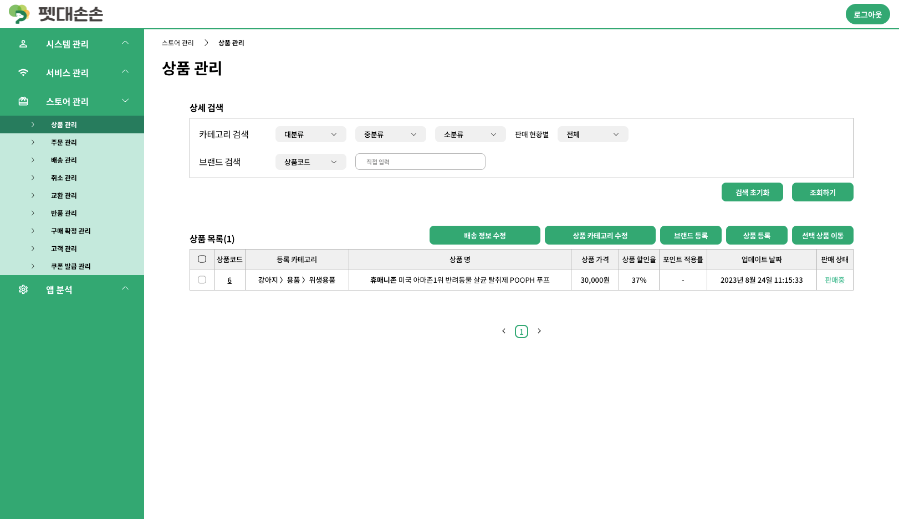

# 개요

> 펫대손손 admin 스토어 부분 담당

내 반려동물의 가계도부터, 전반적인 케어(건강 수첩, 산책, 돌봄, 분양 등)를 단 하나의 앱으로 제공하는 올인원 반려동물 케어 서비스

# 담당 개발 내용

## 프로젝트 세팅

- CRA를 통한 React 프로젝트 생성 (TypeScript)
- 초기 라이브러리 설치
- 폴더 구조
- `recoil`을 통한 상태관리
- prettier 및 eslint 세팅

## 퍼블리싱 및 기능

- 상품 관리
  
  - 상품 목록 조회
    
    - 상품 카테고리 검색 - 대/중/소분류
    - 판매 현황별 검색 - 판매중/품절
    - 상품코드/상품명/브랜드 검색
  
  - 상품 카테고리 CRUD
  
  - 브랜드 CRUD
  
  - 상품 CRUD
  
  - 선택 상품 카테고리 이동

- 주문 관리
  
  - 주문 목록 조회
    
    - 상품 주문 번호/주문 번호/상품명/유저코드 검색
    - 기간 검색
  
  - 주문 상세
    
    - 주소 변경 - Daum 우편번호 서비스 API

- 배송 관리
  
  - 주문 상태 별 배송 목록 조회 (주문 요청, 입금 전 주문, 배송 준비 중, 배송 중, 배송 완료, 배송 전 정보 수정, 배송 지연)
  - 배송 상태 변경 - 주문 확인/배송 지연/배송 완료 처리
  - 배송 중 처리 (택배사, 운송장 입력)
  - 미입금 주문 상세 내역 조회
  - 미입금 주문 취소 처리
  - 주문 취소 처리

- 취소 관리
  
  - 주문 상태 별 취소 목록 조회 (취소 요청, 취소 진행중, 취소 완료, 취소 거부)
  
  - 취소 요청 내역
    
    - 취소 요청 확인 처리
    - 취소 거부 (사유 입력)
  
  - 결제 취소 내역 조회

- 교환 관리
  
  - 주문 상태 별 교환 목록 조회 (교환 요청, 교환 수거 중, 수거 완료, 교환 준비 중, 교환 배송 중, 교환 완료, 교환 거부, 교환 지연)
  - 교환 요청 확인 처리
  - 교환 상태 변경 - 수거 완료/교환 준비 중 처리
  - 배송 중 처리 (택배사, 운송장 입력)
  - 교환 완료 처리
  - 교환 거부 (사유 입력)
  - 반품 전환
  - 교환 상세 사유 조회

- 반품 관리
  
  - 주문 상태 별 반품 목록 조회 (반품 요청, 반품 수거 중, 반품 수거 완료, 반품 완료, 반품 거부)
  
  - 반품 요청 내역
    
    - 반품 요청 확인/수거 완료 처리
    - 반품 거부 (사유 입력)
  
  - 반품 상세 사유 조회
  
  - 결제 취소 내역 조회

- 구매 확정 관리
  
  - 구매 확정 상품 목록 조회

- 고객 관리
  
  - 스토어 문의
    
    - 상품 문의 목록 조회
      
      - 기간 검색
      - 문의유형 검색
      - 답변여부 검색 - 답변완료/미답변
      - 주문번호/상품번호 검색
    
    - 상품 문의 상세 조회
    
    - 문의 답변 등록
  
  - 스토어 리뷰
    
    - 상품 리뷰 목록 조회
      
      - 기간 검색
      - 상품번호/상품명/유저코드/구매자명 검색
      - 평점 검색 - 1~5점
    
    - 상품 리뷰 상세 조회
    
    - 리뷰 숨김/보이기
    
    - 리뷰 포인트 지급

## QA

# 산출물

- 상품 관리
  
  
