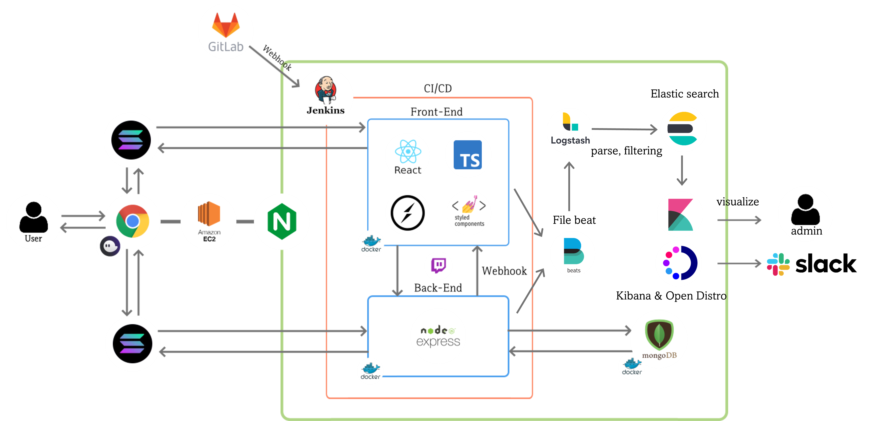
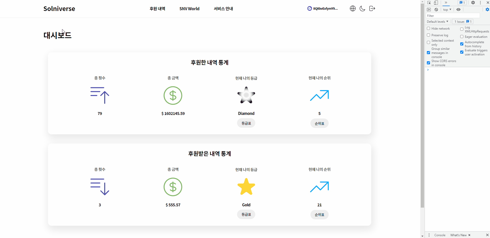
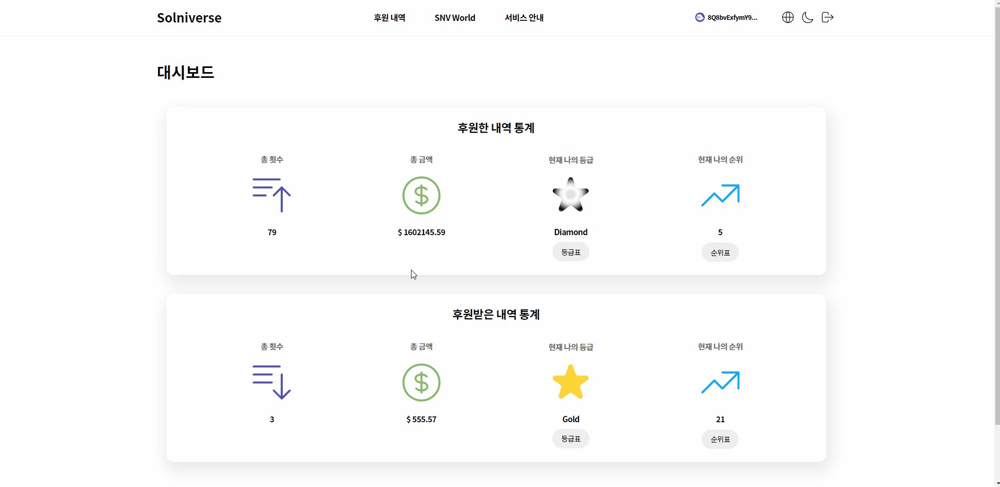
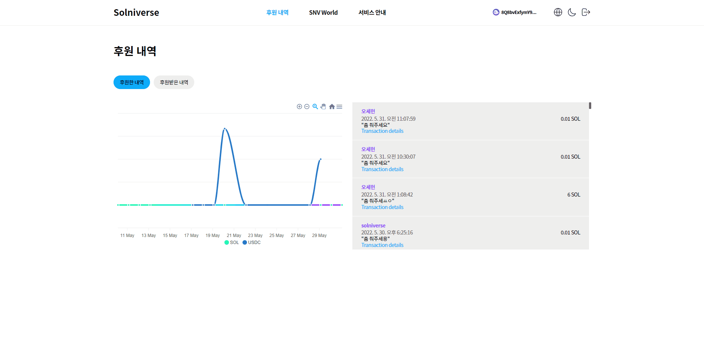
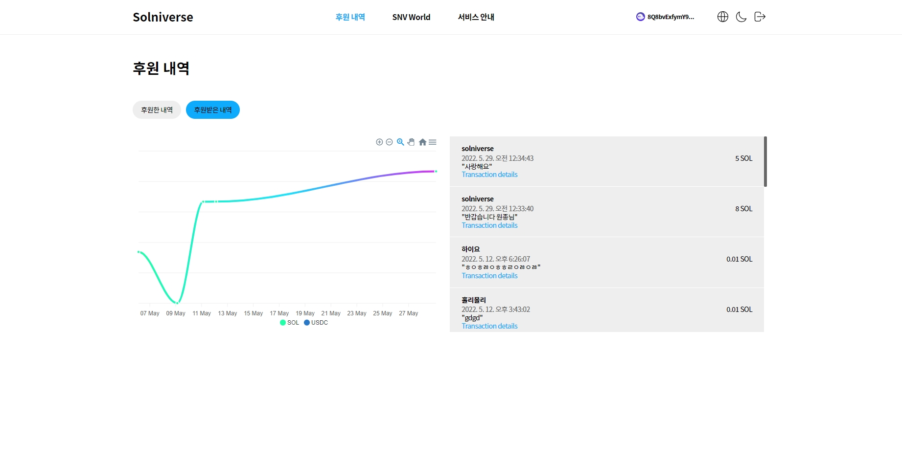
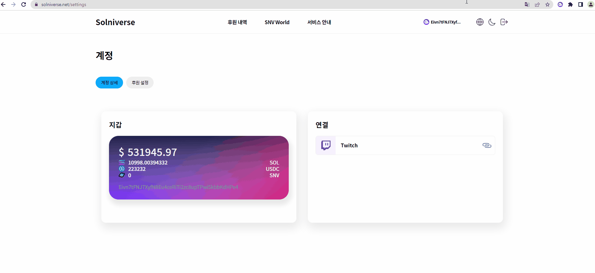
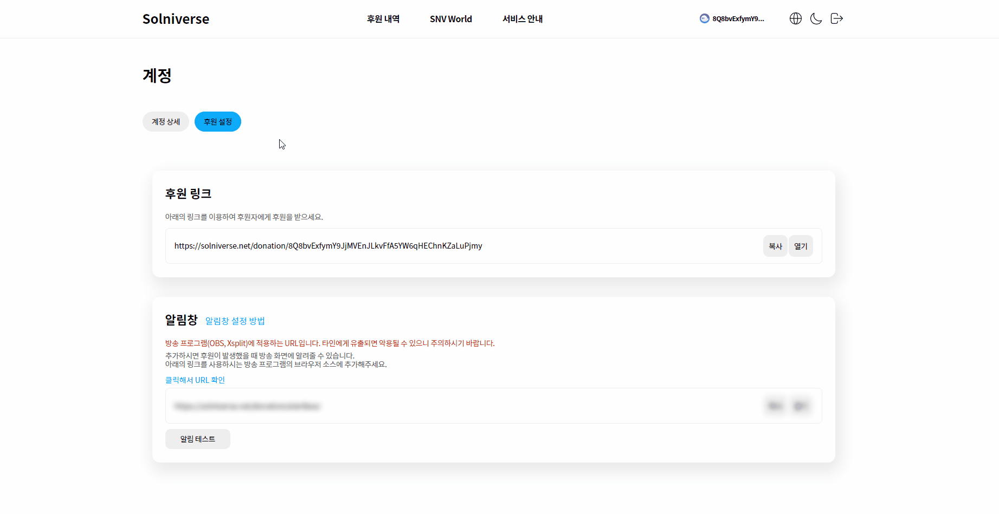
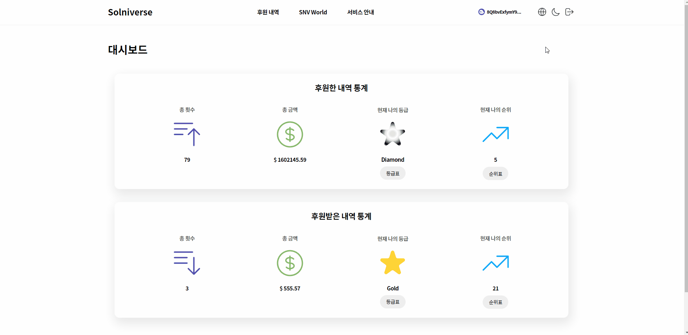

# 개요

> 자율 프로젝트 : 공통, 특화 프로젝트 경험을 바탕으로 자유 주제로 서비스 개발 
>
> 기업연계/오픈소스/자유주제 중 택 1 ➝ 기업연계 선택
>
> 7개 기업 중 선택 ➝ 메인메타(GetPIP.com 서비스를 제공하는 블록체인 기술기반의 스타트업)

인터넷 방송 플랫폼에서 방송하는 크리에이터와 크리에이터에게 후원하는 시청자가 간편하게 Solana pay로 결제하고 후원 내역을 관리하며 다양한 Gamification 기능을 이용할 수 있는 서비스

# 아키텍처

# 담당 개발 내용

## 프로젝트 세팅

- CRA를 통한 React 프로젝트 생성 (TypeScript)
- 초기 라이브러리 설치
- 폴더 구조
- Global style & Theme light/dark
- 반응형 Layout
- `recoil`을 통한 상태관리 (`recoil-persist`를 통한 로컬 스토리지 활용)

## 디자인 및 퍼블리싱

- Navbar & Sidebar
- 메인 페이지
  - 대시보드
  - 등급표
  - 순위표
- 후원 내역 페이지
  - 후원한 내역
  - 후원받은 내역
- 계정 페이지
  - 계정 상세
  - 후원 설정

## 기능

- 메인 대시보드 및 순위 조회
- 후원 내역 `Apexcharts.js`
  - 사용자 지갑 주소로 후원한/후원받은 모든 트랜잭션을 백엔드에서 받아옴
  - 받아온 트랜잭션을 SOL 또는 USDC에 따라 분기
  - 분기된 코인을 Object에 날짜별로 합산
- Twitch OAuth
  - [Authorization code grant flow](https://dev.twitch.tv/docs/authentication/getting-tokens-oauth/#authorization-code-grant-flow) 적용
  - URI에 client_id, redirect_uri 담아 요청
  - 사용자가 로그인 시 redirect_uri로 보내지면 query parameter에서 code를 받아옴
  - useEffect를 활용하여 code 가져왔을 때 백엔드에 code 전송
- Phantom wallet에서 SOL 및 USDC의 잔액과 SNV 토큰 개수 조회 `solana/web3`
- 다국어 기능 `i18next`
  - 적용할 텍스트를 json 파일에 key 값과 함께 정의

# 산출물

- [반응형 Layout 및 Header](https://github.com/wonjongjang/PJT-Solniverse-v2/blob/master/frontend/src/components/Layout.tsx)
  
- [메인 페이지](https://github.com/wonjongjang/PJT-Solniverse-v2/blob/master/frontend/src/pages/my-info/Main.tsx)
  
- [후원 내역](https://github.com/wonjongjang/PJT-Solniverse-v2/blob/master/frontend/src/pages/my-info/DonationHistory.tsx)
  - [후원한 내역](https://github.com/wonjongjang/PJT-Solniverse-v2/blob/master/frontend/src/components/DonationHistory/Send.tsx)
    
  - [후원받은 내역](https://github.com/wonjongjang/PJT-Solniverse-v2/blob/master/frontend/src/components/DonationHistory/Receive.tsx)
    
- [계정 상세](https://github.com/wonjongjang/PJT-Solniverse-v2/blob/master/frontend/src/components/Settings/Account.tsx)
  
- [후원 설정](https://github.com/wonjongjang/PJT-Solniverse-v2/blob/master/frontend/src/components/Settings/Donation.tsx)
  
- [Theme light/dark](https://github.com/wonjongjang/PJT-Solniverse-v2/blob/master/frontend/src/styles/theme.ts)
  
- [다국어](https://github.com/wonjongjang/PJT-Solniverse-v2/blob/master/frontend/src/locales/i18n.ts)
  

# 성과

- 온라인 반별 발표회 후, 반별 상위 2개 팀에 선정 (전국 14개 반, 100여 개 팀 중 28개 팀) ➝ 온라인 전국 발표회 진출
- 온라인 전국 발표회 후, 상위 8개 팀에 선정 ➝ 오프라인 결선 발표회 진출
- 기업연계반 베스트 팀 2회 선정
- 우수상 - 자율 프로젝트 기업연계반 7팀 중 1위
- 우수상 - 자율 프로젝트 결선발표회 입상
- UCC 우수상 - 자율 프로젝트 UCC 전체 2위
- 프로젝트 종료 후에도 메인메타와 지속적인 협업 ➝ 솔라나 해커톤 및 해커하우스 참가
