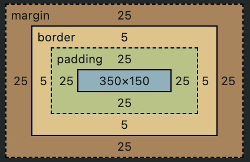

# Box의 구성


| 구성 요소 |                                                                                               |
| :-------: | --------------------------------------------------------------------------------------------- |
|  Content  | 콘텐츠가 표시되는 영역<br /> `width`, `height`                                                |
|  Padding  | 콘텐츠 주변의 여백 영역<br />`padding`                                                        |
|  Border   | 콘텐츠와 패딩을 둘러싼 테두리 영역<br />`border`                                              |
|  Margin   | 콘텐츠, 패딩, 테두리를 둘러싼 가장 바깥 쪽 영역<br />다른 요소 사이의 공백 역할<br />`margin` |

- 박스의 실제 크기

  - 너비 = `border-left` + `padding-left` + `width` + `padding-right` + `border-right`
  - 높이 = `border-top` + `padding-top` + `height` + `padding-bottom` + `border-bottom`

  > `margin`은 박스의 외부 공간에 영향, 박스의 영역은 테두리에서 멈춤

# box-sizing

|     값      |                                                                                |
| :---------: | ------------------------------------------------------------------------------ |
| content-box | 기본값<br />width, height 속성이 content 영역만 포함                           |
| border-box  | width, height 속성이 content, padding, border 영역을 포함<br />(margin 포함 X) |

## content-box

```css
.content-box {
	background-color: goldenrod;
	width: 350px;
	height: 150px;
	margin: 25px;
	padding: 25px;
	border: 5px solid black;
}
```



실제 너비 = 5 + 25 + 350 + 25 + 5 = 410px

실제 높이 = 5 + 25 + 150 + 25 + 5 = 210px

## border-box

```css
.border-box {
	background-color: goldenrod;
	width: 350px;
	height: 150px;
	margin: 25px;
	padding: 25px;
	border: 5px solid black;
	box-sizing: border-box;
}
```


실제 너비 = 5 + 25 + 290 + 25 + 5 = 350px

실제 높이 = 5 + 25 + 90 + 25 + 5 = 150px

# 참고

- [The box model - Learn web development | MDN](https://developer.mozilla.org/en-US/docs/Learn/CSS/Building_blocks/The_box_model)
