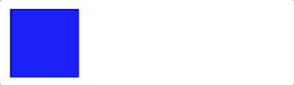

요소의 스타일이 점차적으로 변경되는 것

- 애니메이션 구현 방법
  - CSS transitions
  - CSS animations `@keyframes`
  - JavaScript-based animations `requestAnimationFrame()`

> **CSS transitions 및 CSS animations**
>
> 모두 애니메이션을 만드는 데 사용될 수 있으나 transition은 animation 보다 효과가 제한적 (@keyframes 규칙 유무)
>
> 성능 측면에서 차이 X

> **CSS animations 및 JavaScript-based animations**
>
> 대부분의 경우 성능 거의 동일
>
> JavaScript-based animations 라이브러리에 따라 더 나은 성능을 달성할 수도 있음
>
> 가능한 한 CSS animations를 사용하여 애니메이션 구현
>
> 다만, 애니메이션이 아주 복잡한 경우 JavaScript-based animations에 의존할 필요 존재

# CSS animations

- 구성
  - animation 속성/하위 속성
  - @keyframes 규칙

## 속성

|            속성             |                                                         |
| :-------------------------: | ------------------------------------------------------- |
|         `animation`         | 모든 애니메이션 속성 한번에 지정하는 shorthand          |
|      `animation-delay`      | 요소가 로드된 후 언제 애니메이션이 시작될지 지정        |
|    `animation-direction`    | 애니메이션 종료된 후 진행 방향 지정                     |
|    `animation-duration`     | 애니메이션 한 사이클의 소요 시간 지정                   |
| `animation-iteration-count` | 애니메이션 반복 횟수 지정                               |
|      `animation-name`       | @keyframes 이름 지정                                    |
|   `animation-play-state`    | 애니메이션 재생 상태 지정 (재생/중지)                   |
| `animation-timing-function` | 애니메이션이 진행되는 방식 지정 (속도 변화)             |
|    `animation-fill-mode`    | 애니메이션 실행 전과 후에 스타일을 적용하는 방법을 지정 |

## @keyframes

애니메이션 시퀀스 동안 주어진 시간에 애니메이션 요소가 어떻게 렌더링되어야 하는지를 설명

```css
/* property-a가 value-a 에서 value-b 로 변경됨 */
@keyframes animation-name {
  from {
    property-a: value-a;
  }
  to {
    property-a: value-b;
  }
}

/* 백분율을 사용하여 더 많은 단계 추가 가능 */
@keyframes animation-name {
  0% {
    property-a: value-a;
  }
  50% {
    property-a: value-b;
  }
  100% {
    property-a: value-c;
  }
}
```

## 예시

```html
<!-- HTML -->

<body>
  <div></div>
</body>
```

```css
/* CSS */

div {
  background-color: blue;
  width: 100px;
  height: 100px;
  animation-name: move, circle; /* 사용하고자 하는 @keyframes 선택 (1개 이상 가능) */
  animation-duration: 5s;
  animation-iteration-count: infinite; /* 무한 반복 */
}

@keyframes move {
  from {
    margin-left: 0;
  }
  to {
    margin-left: 300px;
  }
}

@keyframes circle {
  0% {
    border-radius: 0;
  }
  50% {
    border-radius: 100%;
  }
  100% {
    border-radius: 0;
  }
}
```



# 참고

- [CSS and JavaScript animation performance - Web performance | MDN](https://developer.mozilla.org/en-US/docs/Web/Performance/CSS_JavaScript_animation_performance)
- [Using CSS animations - CSS: Cascading Style Sheets | MDN](https://developer.mozilla.org/en-US/docs/Web/CSS/CSS_animations/Using_CSS_animations)
