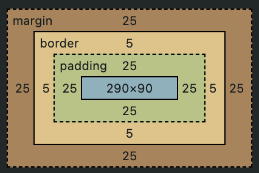

모든 HTML 요소를 감싸는 상자

# Box의 구성


| 구성 요소 |                                                              |
| :-------: | ------------------------------------------------------------ |
|  Content  | 콘텐츠가 표시되는 영역<br />글, 이미지, 비디오 등의 실제 내용<br />배경색, 배경 이미지 포함<br /> `width`, `height` |
|  Padding  | 콘텐츠 주변의 여백 영역<br />콘텐츠 영역을 요소의 안쪽 여백까지 포함하는 크기로 확장<br />`padding` |
|  Border   | 콘텐츠와 패딩을 둘러싼 테두리 영역<br />`border`             |
|  Margin   | 콘텐츠, 패딩, 테두리를 둘러싼 가장 바깥 쪽 영역<br />다른 요소 사이의 공백 역할<br />`margin` |

# 유형

## 표준 박스 모델(Standard box model)

브라우저의 기본 박스 모델

- 속성 (기본값, 생략 가능)

  `box-sizing: content-box`

  width, height 속성이 content 영역만 포함

- 크기 계산

  - 너비 = width + padding + border
  - 높이 = height + padding + border

```css
.content-box {
	background-color: goldenrod;
	width: 350px;
	height: 150px;
	margin: 25px;
	padding: 25px;
	border: 5px solid black;
}
```


총 너비 = 5 + 25 + 350 + 25 + 5 = 410px

총 높이 = 5 + 25 + 150 + 25 + 5 = 210px

## 대체 박스 모델(Alternative box model)

- 속성

  `box-sizing: border-box`

  width, height 속성이 content, padding, border 영역을 포함 (margin 포함 X)

- 크기 계산

  - 너비 = width
  - 높이 = height

```css
.border-box {
	background-color: goldenrod;
	width: 350px;
	height: 150px;
	margin: 25px;
	padding: 25px;
	border: 5px solid black;
	box-sizing: border-box;
}
```



총 너비 = 5 + 25 + 290 + 25 + 5 = 350px

총 높이 = 5 + 25 + 90 + 25 + 5 = 150px

# 참고

- [The box model - Learn web development | MDN](https://developer.mozilla.org/en-US/docs/Learn/CSS/Building_blocks/The_box_model)
