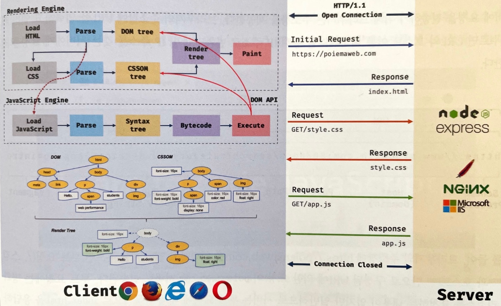

브라우저는 HTML, CSS, 자바스크립트로 작성된 텍스트 문서를 파싱(해석)하여 렌더링

> **웹 브라우저(Web browser)**
>
> World Wide Web을 탐색하는 데 사용하는 소프트웨어 응용 프로그램

> **파싱(parsing)**
>
> 프로그래밍 언어의 문법에 맞게 작성된 텍스트 문서를 읽어 들여 실행하기 위해 텍스트 문서의 문자열을 토큰으로 분해하고, 토큰에 문법적 의미와 구조를 반영하여 parse tree(트리 구조의 자료구조)를 생성하는 일련의 과정
>
> 일반적으로 파싱 완료 후 parse tree를 기반으로 중간 언어인 바이트코드(bytecode)를 생성하고 실행

> **렌더링(rendering)**
>
> HTML, CSS, 자바스크립트로 작성된 문서를 파싱하여 브라우저에 시각적으로 출력하는 것

1. 브라우저는 HTML, CSS, 자바스크립트, 이미지, 폰트 파일 등 렌더링에 필요한 리소스를 요청하고 서버로부터 응답 받음

2. 브라우저의 렌더링 엔진은 서버로부터 응답된 HTML과 CSS를 파싱하여 DOM과 CSSOM을 생성하고 이들을 결합하여 렌더 트리 생성

3. 브라우저의 자바스크립트 엔진은 서버로부터 응답된 자바스크립트를 파싱하여 AST(Abstract Syntax Tree)를 생성하고 바이트코드로 변환하여 실행. 이때 자바스크립트는 DOM API를 통해 DOM 또는 CSSOM을 변경 가능. 변경된 DOM과 CSSOM은 다시 렌더 트리로 결합

   > **리플로우(reflow)**
   >
   > 레이아웃을 계산을 다시 하는 것
   >
   > 노드 추가/삭제, 요소의 크기/위치 변경, 윈도우 리사이징 등 레이아웃에 영향을 주는 변경이 발생한 경우에 한하여 실행

   > **리페인트(repaint)**
   >
   > 재결합된 렌더 트리를 기반으로 다시 페인트 하는 것

4. 렌더 트리를 기반으로 HTML 요소의 레이아웃(위치와 크기)을 계산하고 브라우저 화면에 HTML 요소를 페인팅

# 요청과 응답

렌더링에 필요한 리소스가 모두 서버에 존재하므로 필요한 리소스를 서버에 요청하고 서버가 응답한 리소스를 파싱하여 렌더링

서버에 요청을 전송하기 위해 브라우저는 주소창 제공

1. 브라우저 주소창에 URL 입력 후 엔터 키
2. DNS를 통해 URL의 도메인 네임을 IP 주소로 변환
3. HTTP 프로토콜을 사용하여 HTTP 요청 메세지를 생성함
4. TCP/IP 연결을 통해 HTTP 요청이 웹 서버로 전송됨
5. 웹 서버는 HTTP 프로토콜을 활용해 HTTP 응답 메세지를 생성함
6. TCP/IP 연결을 통해 요청한 컴퓨터로 전송
7. 도착한 HTTP 응답 메세지는 웹페이지 데이터로 변환되고, 웹 브라우저에 의해 출력되어 사용자가 볼 수 있게 됨

# 참고

- 이웅모. 「모던 자바스크립트 Deep Dive」. 위키북스. 2020
