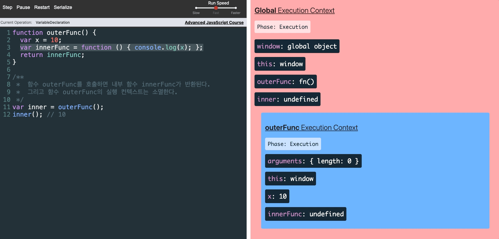

함수를 일급 객체로 취급하는 함수형 프로그래밍 언어의 중요한 특성 (자바스크립트 고유 개념 X)

함수와 그 함수가 선언된 렉시컬 환경(Lexical environment)과의 조합

```javascript
const x = 1;

function outerFunc() {
  const x = 10;
  
  function innerFunc1() {
    console.log(x);
  }
  
  innerFunc1();	// 10
  innerFunc2(); // 1
}

function innerFunc2() {
  console.log(x);
}

outerFunc();
```

- outerFunc 함수 내부에서 정의되고 호출된 innerFunc1 → outerFunc의 x에 접근 가능

  중첩 함수 innerFunc1의 상위 스코프는 outerFunc의 스코프

- outerFunc 함수 내부에서 정의되지 않고 호출된 innerFunc2 → outerFunc의 x에 접근 불가능

⇒ 자바스크립트가 렉시컬 스코프를 따르는 언어이기 때문에 발생하는 현상

> **렉시컬 스코프(Lexical scope) = 정적 스코프**
>
> 함수를 어디서 호출하는지가 아니라 어디에 선언하였는지에 따라 결정
>
> 상위 스코프에 대한 참조는 함수 정의가 평가되는 시점에 함수가 정의된 환경(위치)에 의해 결정

> **상위 스코프**
>
> 함수 정의가 위치하는 스코프
>
> [[Environment]]에 저장된 현재 실행 중인 실행 컨텍스트의 렉시컬 환경의 참조

> **[[Environment]]**
>
> 함수 객체의 내부 슬롯
>
> 상위 스코프의 참조(자신이 정의된 환경)를 저장
>
> 이를 통해 함수 객체는 자신이 존재하는 한 상위 스코프를 기억



outerFunc 함수는 중첩 함수 innerFunc을 반환하고 생명 주기 마감(outerFunc 실행 컨텍스트가 스택에서 제거)

outerFunc의 지역 변수 x 또한 유효하지 않게 되어야 하지만 10이 출력되고 있음 

이처럼 외부 함수보다 중첩 함수가 더 오래 유지되는 경우, 중첩 함수는 이미 생명 주기가 종료한 외부 함수의 변수 참조 가능

⇒ 이러한 중첩 함수가 클로저 (중첩 함수가 상위 스코프의 식별자를 참조하면서 외부 함수보다 더 오래 유지되는 경우)

innerFunc의 [[Environment]] 내부 슬롯에 outerFunc 함수의 렉시컬 환경을 상위 스코프로서 저장하고 있기에 가능

outerFunc 함수의 실행 컨텍스트는 스택에서 제거되지만 outerFunc 함수의 렉시컬 환경까지 소멸 X (가비지 컬렉터는 누군가가 참조하고 있는 메모리 공간을 함부로 해제하지 않음)

클로저는 자유 변수에 묶여있는 함수

> **자유 변수(free variable)**
>
> 클로저에 의해 참조되는 상위 스코프의 변수 (위 예제의 경우 outerFunc 함수의 x 변수)

# 클로저 활용

- 상태(state)를 안전하게 변경 및 유지
  - 상태를 안전하게 은닉

  - 특정 함수에게만 상태 변경 허용

- 캡슐화와 정보 은닉

# 참고

- 이웅모. 「모던 자바스크립트 Deep Dive」. 위키북스. 2020
- [PoiemaWeb](https://poiemaweb.com/js-closure)
- [JavaScript Visualizer](https://ui.dev/javascript-visualizer)
