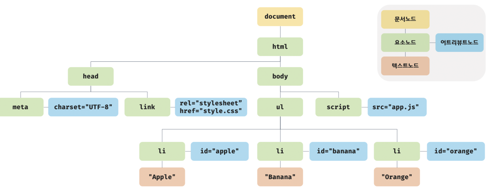
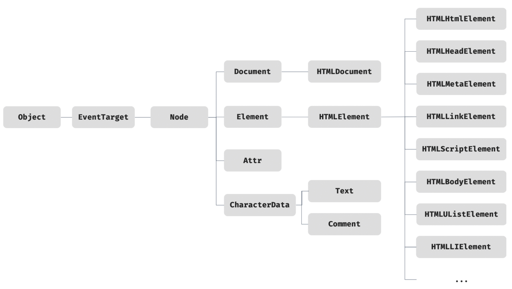

HTML 문서의 계층적 구조와 정보를 표현하며 이를 제어할 수 있는 API(프로퍼티와 메서드)를 제공하는 트리 자료구조

노드 객체들로 구성된 트리 자료구조 → DOM 트리

노드 타입에 따라 필요한 기능을 DOM API로 제공

> **DOM API**
>
> 프로퍼티와 메서드의 집합
>
> HTML의 구조/내용/스타일 등을 동적으로 조작 가능

# 노드 객체

HTML 요소는 렌더링 엔진에 의해 파싱되어 DOM을 구성하는 노드 객체로 변환

```html
<div class="greeting">Hello</div>
```

- 요소 `div` → 요소 노드
- 요소의 어트리뷰트 `class="greeting"` → 어트리뷰트 노드
- 요소의 텍스트 콘텐츠 `Hello` → 텍스트 노드

HTML 문서의 구성 요소인 HTML 요소를 객체화한 모든 노드 객체들을 트리 자료 구조로 구성

## 타입



|                 타입                  | 설명                                                         |
| :-----------------------------------: | :----------------------------------------------------------- |
|    문서 노드<br />(document node)     | · DOM 트리의 최상위에 존재하는 루트 노드 → DOM 트리의 노드들에 접근하기 위한 진입점 역할<br />· document 객체를 가리킴 → window.document 또는 document로 참조 가능<br />· HTML 문서당 document 객체는 유일 |
|     요소 노드<br />(element node)     | · HTML 요소를 가리키는 객체<br />· HTML 요소 간 중첩에 의해 부자 관계 가짐 → 문서의 구조를 표현 |
| 어트리뷰트 노드<br />(attribute node) | · HTML 요소의 어트리뷰트를 가리키는 객체<br />· 어트리뷰트가 지정된 HTML 요소의 요소 노드와 연결 (부모 노드와 연결 X → 요소 노드의 형제 노드 X)<br />· 요소 노드에 접근하여 어트리뷰트 참조/변경 가능 |
|     텍스트 노드<br />(text node)      | · HTML 요소의 텍스트를 가리키는 객체<br />· 문서의 정보를 표현<br />· 요소 노드의 자식 노드이자 리프 노드<br />· DOM 트리의 최종단 → 요소 노드에 접근하여 텍스트 노드에 접근 가능 |

## 상속 구조

노드 객체는 표준 빌트인 객체(standard built-in objects)가 아닌 호스트 객체(host objects)

자바스크립트 객체이므로 프로토타입에 의한 상속 구조 가짐



- 모든 노드 객체
  - 공통 기능
    - EventTarget : 이벤트에 관련된 기능
    - Node : 트리 탐색 기능, 노드 정보 제공 기능
- 요소 노드 객체
  - 공통 기능
    - HTMLElement : style 프로퍼티
  - 고유 기능
    - HTMLInputElement : value 프로퍼티 필요
    - HTMLDivElement : value 프로퍼티 필요 X

⇒ 공통 기능일수록 프로토타입 체인의 상위, 고유 기능일수록 프로토타입 하위에 프로토타입 체인을 구축

# 참고

- 이웅모. 「모던 자바스크립트 Deep Dive」. 위키북스. 2020
