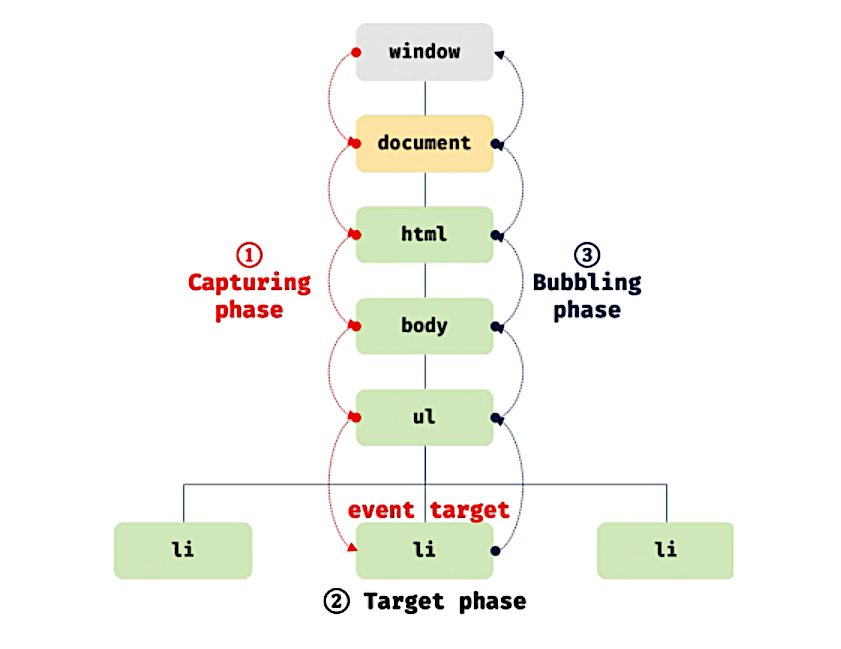

브라우저는 처리해야 할 특정 사건이 발생하면 이를 감지하여 이벤트를 발생 (클릭, 키보드 입력, 마우스 이동 등)

특정 타입의 이벤트에 대해 반응하여 어떤 일을 하고 싶다면, 해당하는 타입의 이벤트가 발생했을 때 호출될 함수를 브라우저에게 알려 호출을 위임

# 이벤트 핸들러 등록

> **이벤트 핸들러(event handler)**
>
> 이벤트가 발생했을 때 호출될 함수

이벤트가 발생했을 때 브라우저에게 이벤트 핸들러의 호출을 위임하는 것

- 이벤트 핸들러 어트리뷰트 방식
- 이벤트 핸들러 프로퍼티 방식
- addEventListener 메서드 방식

# 이벤트 전파

DOM 트리 상에 존재하는 DOM 요소 노드에서 발생한 이벤트는 DOM 트리를 통해 전파

생성된 이벤트 객체는 이벤트 타깃을 중심으로 DOM 트리를 통해 전파

> **이벤트 타깃(event target)**
>
> 이벤트를 발생시킨 DOM 요소

```html
<!DOCTYPE html>
<html>
<body>
  <ul id="fruits">
    <li id="apple">Apple</li>
    <li id="banana">Banana</li>	<!-- 클릭 시 클릭 이벤트 발생 (이벤트 타깃) -->
    <li id="orange">Orange</li>
  </ul>
</body>
</html>
```



1. 캡처링 단계(capturing phase) : 이벤트가 상위 요소에서 하위 요소 방향으로 전파 (window → 이벤트 타깃)
2. 타깃 단계(target phase) : 이벤트가 이벤트 타깃에 도달
3. 버블링 단계(bubbling phase) : 이벤트가 하위 요소에서 상위 요소 방향으로 전파 (이벤트 타깃 → window)

⇒ DOM 트리를 통해 전파되는 이벤트는 이벤트 패스에 위치한 모든 DOM 요소에서 캐치 가능

캡처링 단계의 이벤트 캐치는 addEventListener 메서드의 3번째 인수로 true를 전달해야만 가능

대부분의 이벤트는 캡처링과 버블링을 통해 전파

| 버블링을 통해 전파되지 않는 이벤트 |          종류           | 상위 요소에서 캐치해야 할 때 대체할 이벤트 |
| :--------------------------------: | :---------------------: | :----------------------------------------: |
|           포커스 이벤트            |       focus/blur        |             focusing/focusout              |
|           리소스 이벤트            | load/unload/abort/error |                                            |
|           마우스 이벤트            |  mouseenter/mouseleave  |             mouseover/mouseout             |

# DOM 요소의 기본 동작 조작

- DOM 요소의 기본 동작 중단

  이벤트 객체의 preventDefault 메서드

  DOM 요소의 기본 동작을 중단

- 이벤트 전파 방지

  이벤트 객체의 stopPropagtion 메서드

  하위 DOM 요소의 이벤트를 개별적으로 처리하기 위해 이벤트의 전파를 중단

# 참고

- 이웅모. 「모던 자바스크립트 Deep Dive」. 위키북스. 2020
