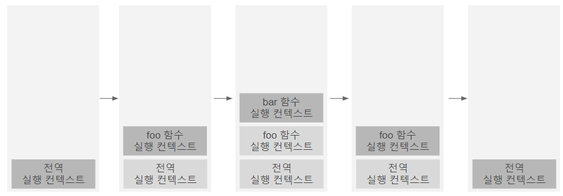

자바스크립트의 동작 원리를 담고 있는 핵심 개념

소스코드를 실행하는 데 필요한 환경을 제공하고 코드의 실행 결과를 실제로 관리하는 영역

소스코드의 타입에 따라 실행 컨텍스트를 생성하는 과정과 관리 내용이 다름

|         소스코드 타입          |                                           설명                                           |   실행 컨텍스트    |
| :----------------------------: | :--------------------------------------------------------------------------------------: | :----------------: |
|  전역 코드<br />(global code)  |      전역에 존재하는 소스코드<br />전역에 정의된 함수, 클래스 등의 내부 코드 포함 X      | 전역 실행 컨텍스트 |
| 함수 코드<br />(function code) | 함수 내부에 존재하는 소스코드<br />함수 내부에 중첩된 함수, 클래스 등의 내부 코드 포함 X | 함수 실행 컨텍스트 |
|   eval 코드<br />(eval code)   |             빌트인 전역 함수인 eval 함수에 인수로 전달되어 실행되는 소스코드             | eval 실행 컨텍스트 |
|  모듈 코드<br />(module code)  |    모듈 내부에 존재하는 소스코드<br />모듈 내부의 함수, 클래스 등의 내부 코드 포함 X     | 모듈 실행 컨텍스트 |

식별자(변수, 함수, 클래스 등의 이름)를 등록하고 관리하는 스코프와 코드 실행 순서 관리를 구현한 내부 메커니즘. 모든 코드는 실행 컨텍스트를 통해 실행되고 관리

- 식별자와 스코프 - 렉시컬 환경으로 관리
- 코드 실행 순서 - 실행 컨텍스트 스택으로 관리

# 소스코드의 평가와 실행

자바스크립트 엔진은 소스코드를 2개의 과정으로 나누어 처리

1. 소스코드의 평가
   - 실행 컨텍스트 생성
   - 변수, 함수 등의 선언문 먼저 실행
   - 생성된 변수/함수 식별자를 키로 실행 컨텍스트가 관리하는 스코프에 등록
2. 소스코드의 실행
   - 런타임 시작 - 선언문을 제외한 소스코드가 순차적으로 실행
   - 소스코드 실행에 필요한 정보(변수/함수의 참조)를 실행 컨텍스트가 관리하는 스코프에서 검색하여 취득
   - 소스코드의 실행 결과(변수 값의 변경 등)는 다시 실행 컨텍스트가 관리하는 스코프에 등록

# 렉시컬 환경(Lexical Environment)

식별자, 식별자에 바인딩된 값, 상위 스코프에 대한 참조를 기록하는 자료구조

실행 컨텍스트를 구성하는 컴포넌트

키와 값을 갖는 객체 형태의 스코프(전역/함수/블록 스코프)를 생성하여 식별자를 키로 등록하고 식별자에 바인딩된 값을 관리

스코프를 구분하여 식별자를 등록하고 관리하는 저장소 역할을 하는 렉시컬 스코프의 실체

## 렉시컬 환경의 컴포넌트 구성

- 환경 레코드(EnvironmentRecord)

  스코프에 포함된 식별자를 등록하고 등록된 식별자에 바인딩된 값을 관리하는 저장소 (소스코드 타입에 따라 관리)

- 외부 렉시컬 환경에 대한 참조(OuterLexicalEnvironmentReference)

  상위 스코프를 가리킴

  단방향 링크드 리스트인 스코프 체인을 구현

  > **상위 스코프**
  >
  > 외부 렉시컬 환경
  >
  > 해당 실행 컨텍스트를 생성한 소스코드를 포함하는 상위 코드의 렉시컬 환경

# 실행 컨텍스트 스택 = 콜 스택(call stack)

실행 컨텍스트는 스택 자료구조로 관리

코드의 실행 순서를 관리하는 것

실행 컨텍스트 스택의 최상위에 존재하는 실행 컨텍스트는 언제나 실행 중인 코드의 실행 컨텍스트

실행 컨텍스트 스택의 최상위에 존재하는 실행 컨텍스트 = 실행 중인 실행 컨텍스트(running execution context)

```javascript
const x = 1

function foo() {
  const y = 2

  function bar() {
    const z = 3
    console.log(x + y + z)
  }
  bar()
}

foo() // 6
```



1. 전역 코드의 평가와 실행

   - 평가
     - 전역 실행 컨텍스트 생성 및 실행 컨텍스트 스택에 푸시
     - 전역 변수 x와 전역 함수 foo가 전역 실행 컨텍스트에 등록
   - 실행
     - 전역 변수 x에 값 할당 및 전역 함수 foo 호출

2. foo 함수 코드의 평가와 실행

   전역 함수 foo가 호출되면 전역 코드의 실행이 일시 중단되고 코드의 제어권이 foo 함수 내부로 이동

   - 평가
     - foo 함수 실행 컨텍스트 생성 및 실행 컨텍스트 스택에 push
     - foo 함수의 지역 변수 y와 중첩 함수 bar가 foo 함수 실행 컨텍스트에 등록
   - 실행
     - 지역 변수 y에 값 할당 및 중첩 함수 bar 호출

3. bar 함수 코드의 평가와 실행

   중첩 함수 bar가 호출되면 foo 함수 코드의 실행이 일시 중단되고 코드의 제어권이 bar 함수 내부로 이동

   - 평가

     - bar 함수 실행 컨텍스트 생성 및 실행 컨텍스트 스택에 push
     - bar 함수의 지역 변수 z가 실행 컨텍스트에 등록

   - 실행

     - 지역 변수 z에 값 할당 및 console.log 메서드 호출

       > console.log 메서드도 함수라 실행 컨텍스트 스택에 푸시하지만 생략

     - bar 함수 종료

4. foo 함수 코드로 복귀

   bar 함수가 종료되면 코드의 제어권이 foo 함수로 이동

   bar 함수 실행 컨텍스트를 실행 컨텍스트 스택에서 pop

   foo 함수 종료

5. 전역 코드로 복귀

   foo 함수가 종료되면 코드의 제어권이 전역 코드로 이동

   foo 함수 실행 컨텍스트를 실행 컨텍스트 스택에서 pop

   더 이상 실행할 전역 코드가 없으므로 전역 실행 컨텍스트를 실행 컨텍스트 스택에서 pop

# 참고

- 이웅모. 「모던 자바스크립트 Deep Dive」. 위키북스. 2020
