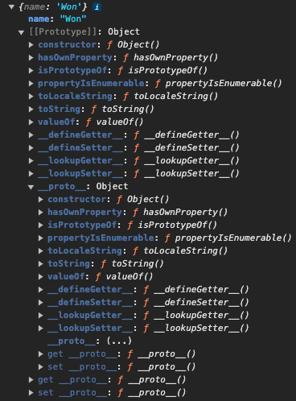
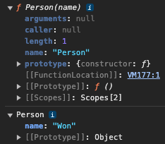

모든 객체는 자신의 부모 역할을 담당하는 객체와 연결되어 있는데 이러한 부모 객체를 지칭

객체 지향의 상속 개념과 같이 부모 객체의 프로퍼티/메소드를 상속 받아 사용 가능

# 객체 리터럴로 생성된 객체

```js
const person = {
  name: 'Won'
};

console.log(person);

console.log(person.__proto__ === Object.prototype); // true
```



- [[Prototype]]
  
  - 모든 객체가 보유한 인터널 슬롯
  
  - 객체의 입장에서 자신의 부모 역할을 하는 프로토타입 객체를 가리키며, 함수 객체의 경우 `Function.prototype`를 가리킴

- constructor
  
  - 객체의 입장에서 자신을 생성한 객체를 가리킴

# 생성자 함수로 생성된 객체

```js
function Person(name) {
  this.name = name;
}

const temp = new Person('Won');

console.dir(Person); // prototype 프로퍼티 O
console.dir(temp);   // prototype 프로퍼티 X

console.log(Person.__proto__ === Function.prototype);

console.log(temp.__proto__ === Person.prototype);

// Person() 생성자 함수에 의해 생성된 객체를 생성한 객체는 Person() 생성자 함수
console.log(Person.prototype.constructor === Person);

// temp 객체를 생성한 객체는 Person() 생성자 함수
console.log(temp.constructor === Person);

// Person() 생성자 함수를 생성한 객체는 Function() 생성자 함수
console.log(Person.constructor === Function);
```



- prototype
  
  - 함수 객체만 가지고 있는 프로퍼티
  
  - 함수 객체가 생성자로 사용될 때 이 함수를 통해 생성될 객체의 부모 역할을 하는 객체(프로토타입 객체)를 가리킴

# 참고

- [PoiemaWeb](https://poiemaweb.com/js-prototype#42-%EC%83%9D%EC%84%B1%EC%9E%90-%ED%95%A8%EC%88%98%EB%A1%9C-%EC%83%9D%EC%84%B1%EB%90%9C-%EA%B0%9D%EC%B2%B4%EC%9D%98-%ED%94%84%EB%A1%9C%ED%86%A0%ED%83%80%EC%9E%85-%EC%B2%B4%EC%9D%B8)
