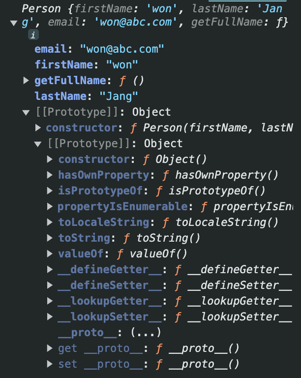
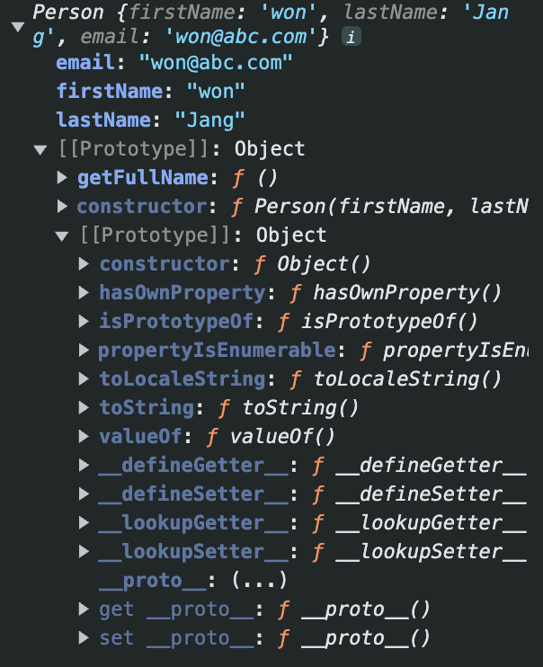

# 상속과 프로토타입

자바스크립트는 프로토타입 기반으로 상속을 구현하여 불필요한 중복 제거 (기존 코드 재사용) → 개발 비용↓

```javascript
// 생성자 함수
function Person(firstName, lastName, email) {
	this.firstName = firstName;
	this.lastName = lastName;
	this.email = email;
	this.getFullName = function () {
		return `${this.lastName} ${this.firstName}`;
	};
}

// 인스턴스 생성
const person1 = new Person('won', 'Jang', 'won@abc.com');
const person2 = new Person('andy', 'Ahn', 'andy@abc.com');

console.log(person1.getFullName === person2.getFullName); // false

console.log(person1.getFullName()); // Jang won
console.log(person2.getFullName()); // Ahn andy
```



인스턴스를 생성할 때마다 동일한 동작을 하는 getFullName 메서드를 중복 생성하고 모든 인스턴스가 중복 소유함

중복된 메서드를 하나만 생성하여 모든 인스턴스가 공유해서 사용하는 것이 바람직

- 프로토타입에 추가

  ```javascript
  function Person(firstName, lastName, email) {
  	this.firstName = firstName;
  	this.lastName = lastName;
  	this.email = email;
  }
  Person.prototype.getFullName = function () {
  	return `${this.lastName} ${this.firstName}`;
  };
  
  // 인스턴스 생성
  const person1 = new Person('won', 'Jang', 'won@abc.com');
  const person2 = new Person('andy', 'Ahn', 'andy@abc.com');
  
  console.log(person1.getFullName === person2.getFullName); // true
  
  console.log(person1.getFullName()); // Jang won
  console.log(person2.getFullName()); // Ahn andy
  ```

- Object.create()

  명시적으로 프로토타입을 지정하여 새로운 객체 생성

  ```javascript
  function Person(firstName, lastName, email) {
  	let person = Object.create(personsPrototype);
  	this.firstName = firstName;
  	this.lastName = lastName;
  	this.email = email;
  	return person;
  }
  const personsPrototype = {
  	getFullName() {
  		return `${this.lastName} ${this.firstName}`;
  	},
  };
  
  // 인스턴스 생성
  const person1 = new Person('won', 'Jang', 'won@abc.com');
  const person2 = new Person('andy', 'Ahn', 'andy@abc.com');
  
  console.log(person1.getFullName === person2.getFullName); // true
  
  console.log(person1.getFullName()); // Jang won
  console.log(person2.getFullName()); // Ahn andy
  ```



# 프로토타입 객체

객체 간 상속을 구현하기 위해 사용

어떤 객체의 상위 객체의 역할을 하는 객체로서 다른 객체에 공유 프로퍼티/메서드를 제공

모든 객체는 [[Prototype]]이라는 내부 슬롯을 가짐

- [[Prototype]]에 저장되는 프로토타입은 객체 생성 방식에 의해 결정
  - 객체 리터럴에 의해 생성된 객체 - Object.prototype
  - 생성자 함수에 의해 생성된 객체 - prototype 프로퍼티에 바인딩되어 있는 객체
- [[Prototype]] 내부 슬롯에 직접 접근 X, `__proto__` 접근자 프로퍼티를 통해 간접적으로 접근 가능

# 프로토타입 체인

객체의 프로퍼티/메서드에 접근하려고 할 때, 해당 객체에 접근하려는 프로퍼티가 없다면 [[Prototype]] 내부 슬롯의 참조를 따라 자신의 부모 역할을 하는 프로토타입의 프로퍼티를 순차적으로 검색

상속과 프로퍼티 검색을 위한 메커니즘

# 참고

- [PoiemaWeb](https://poiemaweb.com/js-prototype)
