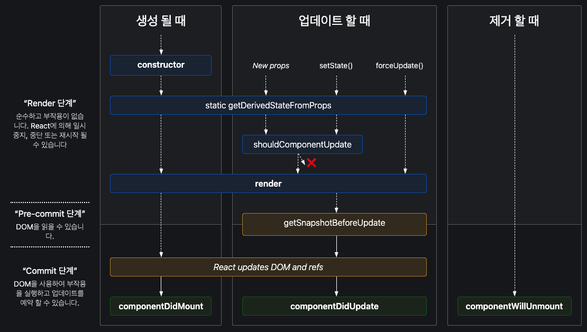

재사용 가능한 UI 요소

- 특징
  - 컴포넌트의 이름은 항상 대문자로 시작
  - JSX 마크업을 반환

# 선언 방식

|                      |                           클래스형                           |                        함수형                        |
| :------------------: | :----------------------------------------------------------: | :--------------------------------------------------: |
|       **정의**       | · ES6 class<br />· React.Component 상속<br />· `render()`를 통해 JSX 반환 |                · 일반 JavaScript 함수                |
| **상태 관리(state)** |               this.state<br />this.setState()                |                    `useState` 훅                     |
|  **생명주기 기능**   |                    생명주기 메서드<br />                     |                    `useEffect` 훅                    |
|       **장점**       |        · 생명주기 메서드를 통한 세밀한 컴포넌트 제어         | · 코드의 간결성<br />· 재사용성<br />· 테스트 용이성 |

> 리액트 팀은 함수형 컴포넌트와 훅을 사용하는 것을 권장

## 생명주기(Lifecycle)

모든 컴포넌트는 여러 종류의 생명주기 메서드 가짐

메서드를 오버라이딩하여 특정 시점에 코드가 실행되도록 설정 가능



|                 주요 생명주기 메서드                 |                                                              |
| :--------------------------------------------------: | ------------------------------------------------------------ |
|                   `constructor()`                    | 컴포넌트가 마운트되기 전에 호출<br />· state 초기화<br />· 이벤트 처리 메서드 바인딩 |
|             `getDerivedStateFromProps()`             | 마운트/업데이트 모두에서 `render()`를 호출하기 직전에 호출<br />· props로 받아 온 값을 state에 동기화 |
|              `shouldComponentUpdate()`               | props/state가 새로운 값으로 갱신되어서 렌더링이 발생하기 직전에 호출<br />· state/props 변경 시 리렌더링을 시작할지 여부 지정<br />· true/false 반환 (기본값 true)<br />· 성능 최적화 목적 |
|                      `render()`                      | · 필수 메서드<br />· this.props와 this.state의 값 활용 가능<br />· JSX 반환<br />· 순수해야 함<br />ㅤ- state 변경 X<br />ㅤ- 호출될 때마다 동일한 결과 반환<br />ㅤ- 브라우저와 직접 상호작용 X |
|                `componentDidMount()`                 | 컴포넌트가 마운트된 직후에 호출<br />· 비동기 작업 처리<br />ㅤ- 이벤트 등록<br />ㅤ- setTimeout<br />ㅤ- setInterval<br />ㅤ- 네트워크 요청 |
| `componentDidUpdate(prevProps, prevState, snapshot)` | 업데이트가 일어난 직후에 호출 (최초 생성 시 호출 X)<br />· DOM 관련 처리<br />· 컴포넌트의 이전 데이터 접근 가능 (prevProps, prevState)<br />· `getSnapshotBeforeUpdate()`를 구현했을 때 반환한 값은 세 번째 인자인 snapshot으로 전달 받음 |
|               `componentWillUnmount()`               | 컴포넌트를 DOM에서 제거하기 직전에 호출<br />· 정리 작업 필요<br />ㅤ- 타이머 제거<br />ㅤ- 네트워크 요청 취소<br />ㅤ- `componentDidMount()`에서 등록한 이벤트 |

# Props

컴포넌트 간 통신 수단

모든 부모 컴포넌트는 props를 통해 자식 컴포넌트에 정보 전달 가능

## Props와 State의 차이

|                    |               **Props**                |             **State**              |
| :----------------: | :------------------------------------: | :--------------------------------: |
| **데이터 소유권**  | 부모 컴포넌트에서 자식 컴포넌트로 전달 |       컴포넌트 내부에서 관리       |
| **변경 가능 여부** |            불변 (immutable)            |           가변 (mutable)           |
|      **목적**      |      다른 컴포넌트로 데이터 전달       | 내부 상태 관리 및 동적 데이터 처리 |
| **리렌더링 조건**  |   부모로부터 새로운 props를 받을 때    |         state가 변경될 때          |

## key

배열의 각 항목을 고유하게 식별할 수 있는 문자열 또는 숫자

```jsx
<li key={person.id}>...</li>
```

정렬 등으로 인해 항목이 이동/삽입/삭제되는 경우, key를 통해 정확히 식별하고 DOM 트리에 올바르게 업데이트 가능

- 주의 사항
  - index 사용 X → 버그 발생 가능성 존재
  - `key={Math.random()}`과 같이 즉석에서 key 생성 X → 불필요한 리렌더링 발생


# 참고

- [Your First Component – React](https://react.dev/learn/your-first-component)
- [함수형 컴포넌트와 클래스형 컴포넌트의 차이점 이해하기](https://f-lab.kr/insight/understanding-functional-vs-class-components)
- [React lifecycle methods diagram](https://projects.wojtekmaj.pl/react-lifecycle-methods-diagram/)
- [Passing Props to a Component – React](https://react.dev/learn/passing-props-to-a-component)
- [Rendering Lists – React](https://react.dev/learn/rendering-lists#keeping-list-items-in-order-with-key)
